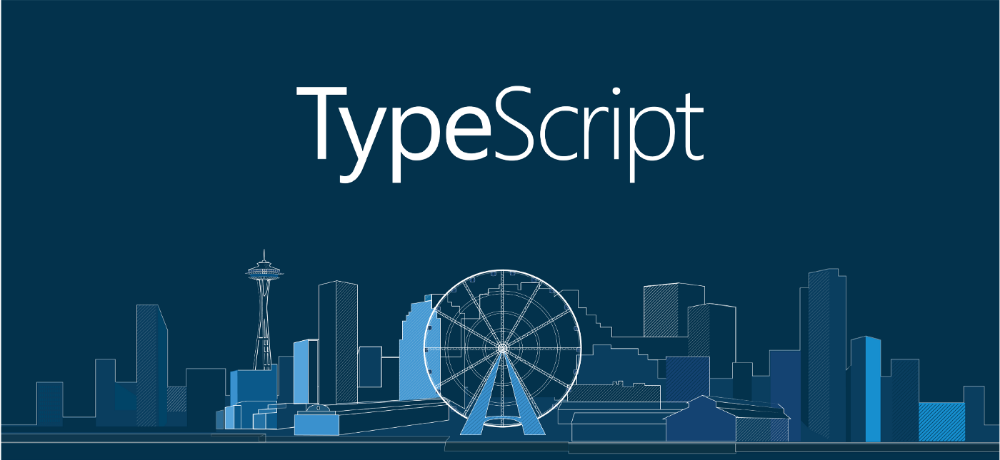

<div align="center">
    <strong>The Next.js Tailwind Starter</strong>
</div>


A starter for [Next.js](https://nextjs.org/) with [Tailwind CSS](https://tailwindcss.com) and Typescript.
Pre-configured with absolute import, [TailwindUI](https://tailwindui.com) and some additional components.

## Quick Installation

```bash
npx create-next-app myapp-name --use-npm -e "https://github.com/riipandi/next-tailwind-starter"
```

> Don't forget to change `myapp-name` with your real application name.

## Quick Start

```bash
# install dependencies
$ npm install --no-optional

# serve with hot reload at localhost:3000
$ npm run dev

# build for production and launch server
$ npm run build
$ npm run start
```

> For detailed explanation on how things work, check out [Next.js docs](https://nextjs.org).

## Deploy your own

You'll want to fork this repository and deploy your own Next.js website. You can do a one-click
deploy with the button below.

[](https://vercel.com/new/git/external?repository-url=https%3A%2F%2Fgithub.com%2Friipandi%2Fnext-tailwind-starter)

Once you have an image generator that sparks joy, you can setup [automatic GitHub](https://vercel.com/github) 
deployments so that pushing to master will deploy to production! 🚀

## License

MIT: [https://aris.mit-license.org/](https://aris.mit-license.org/)

```
Copyright (c) 2021 Aris Ripandi

Permission to use, copy, modify, and/or distribute this software for any purpose with or 
without fee is hereby granted, provided that the above copyright notice and this permission 
notice appear in all copies.

THE SOFTWARE IS PROVIDED "AS IS" AND THE AUTHOR DISCLAIMS ALL WARRANTIES WITH REGARD TO 
THIS SOFTWARE INCLUDING ALL IMPLIED WARRANTIES OF MERCHANTABILITY AND FITNESS. IN NO 
EVENT SHALL THE AUTHOR BE LIABLE FOR ANY SPECIAL, DIRECT, INDIRECT, OR CONSEQUENTIAL 
DAMAGES OR ANY DAMAGES WHATSOEVER RESULTING FROM LOSS OF USE, DATA OR PROFITS, WHETHER 
IN AN ACTION OF CONTRACT, NEGLIGENCE OR OTHER TORTIOUS ACTION, ARISING OUT OF OR IN 
CONNECTION WITH THE USE OR PERFORMANCE OF THIS SOFTWARE.
```
